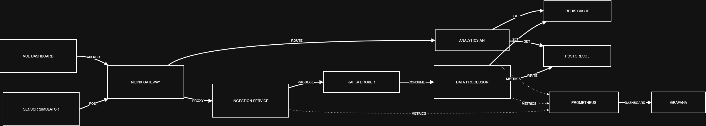

GreenOps — это демонстрационный микросервисный проект системы мониторинга и оптимизации энергопотребления для "Умного города". Система обрабатывает поток данных от тысяч датчиков в реальном времени, выявляет аномалии и предоставляет аналитику через интерактивный дашборд.

Технологический стек

Проект построен на современной облачной архитектуре с использованием событийной модели:

Backend

    Python 3.11 / FastAPI: Асинхронные высокопроизводительные API-сервисы.

    AIOKafka: Асинхронный клиент для работы с брокером сообщений.

    Asyncpg & Redis-py: Высокоскоростные драйверы для работы с базами данных.

Infrastructure & Data

    Apache Kafka: Распределенная шина сообщений (брокер) для передачи сырых данных между сервисами.

    Redis: In-memory хранилище для мгновенного доступа к текущим статусам зданий (Real-time Store).

    PostgreSQL: Реляционная БД для хранения долгосрочной истории потребления.

    Nginx: Reverse Proxy и API Gateway для единой точки входа.

    Docker & Docker Compose: Контейнеризация и оркестрация всех компонентов.

Monitoring & Observability

    Prometheus: Сбор технических метрик (нагрузка, количество запросов, задержки).

    Grafana: Визуальный мониторинг состояния всей инфраструктуры.

Frontend

    Vue 3 (Composition API): Реактивный интерфейс.

    Vite: Сборщик фронтенда.

    Chart.js: Визуализация графиков потребления в реальном времени.

    Axios: Взаимодействие с REST API.

Архитектура системы

<p align="center">
  
</p>

Проект разделен на независимые слои:

    Sensor Simulator: Скрипт, имитирующий поток данных от IoT-датчиков.

    Ingestion Service: Принимает HTTP-трафик и мгновенно сбрасывает его в Kafka (устойчивость к нагрузкам).

    Processor Service: Фоновый воркер, который вычисляет аномалии и распределяет данные по базам (Redis/Postgres).

    Analytics Service: Предоставляет очищенные данные для фронтенда.

    Monitoring Stack: Следит за тем, чтобы ни один микросервис не упал.

Быстрый запуск
```bash
git clone https://github.com/avocadonet/GreenOps
cd GreenOps

docker-compose up -d --build

python simulator.py # для проведения симулятора
```